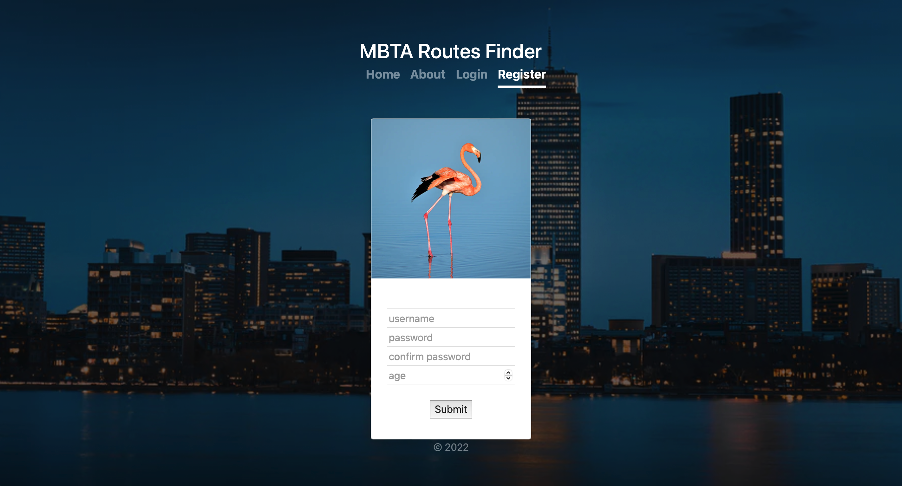

# CS103a CP02
Author : Jiefang Li
This is a course project which has a simple authentication module 
and provides access to a mongoose database in the cloud.

## Installation
Download the project from github and download nodejs and npm from https://nodejs.org
and cd into the folder

Install the packages with
``` bash
npm install
```
Start the project with
``` bash
node app.js
```
or install nodemon (the node monitoring app) with
``` bash
npm install -g nodemon
```
and start the project with
``` bash
nodemon
```

## Use
- Register as a new user under register page


